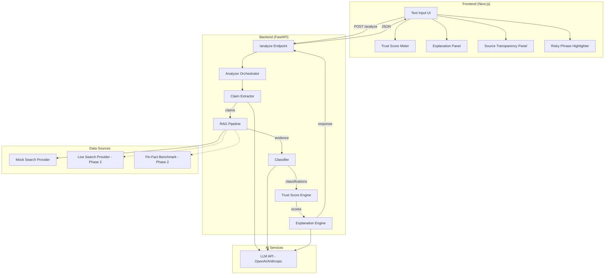
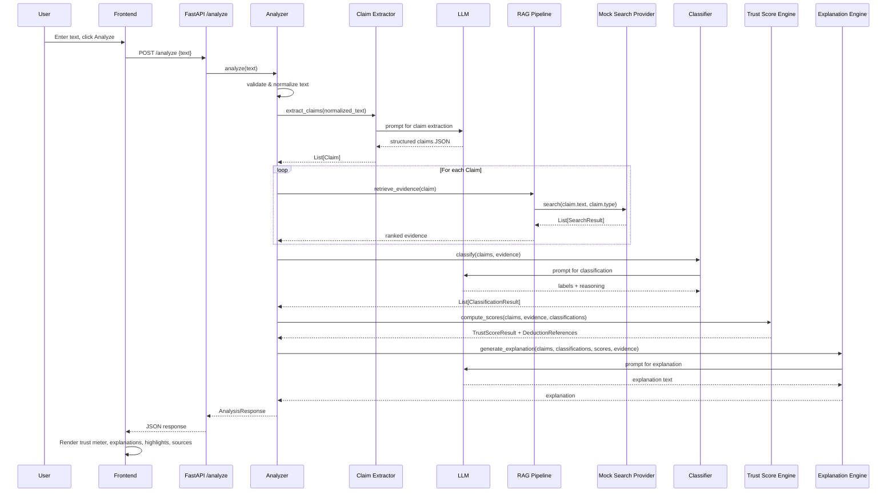
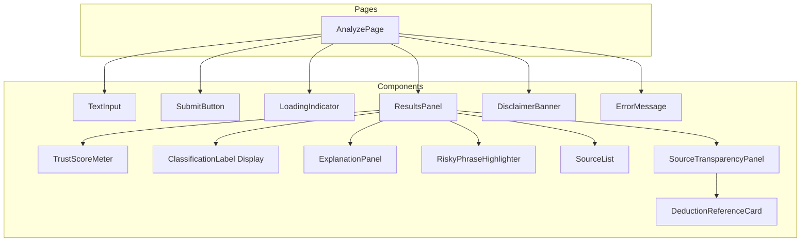
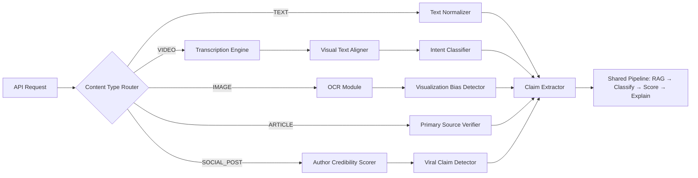

# Design Document: TruthNuke

## Overview

TruthNuke is a full-stack AI-powered financial misinformation detector. Users submit text containing financial claims, and the system extracts individual claims, verifies them against external data sources via a Retrieval-Augmented Generation (RAG) pipeline, classifies misinformation risk, computes a trust score (0–100), and generates human-readable explanations.

The system is built as a decoupled frontend/backend architecture:

- **Backend**: Python FastAPI server exposing a REST API. FastAPI is chosen over Node.js/Express for its native async support, Pydantic data validation (which maps directly to our structured claim/score schemas), and strong ecosystem for ML/LLM integration (LangChain, OpenAI SDK, HuggingFace).
- **Frontend**: React/Next.js single-page application providing text input, trust score visualization, explanation panel, and source transparency display.
- **AI Layer**: LLM-based claim extraction and classification via prompt engineering; RAG pipeline for evidence retrieval; heuristic trust score computation.

### Phase Scope

| Phase | Scope |
|-------|-------|
| **Phase 1 (MVP)** | Text input, LLM claim extraction, prompt-based classification, heuristic trust score (4-component weighted formula), explanation generation, mock search provider, REST API, React frontend with trust meter and explanation panel, source transparency panel |
| **Phase 2** | Real news/financial APIs (Reuters, Bloomberg, AP), improved scoring with real source credibility data, Fin-Fact benchmark grounding, enhanced source display |
| **Phase 3** | Multi-modal support (video transcription, image OCR, social media analysis, article verification), browser extension, real-time monitoring, cross-modal discrepancy detection, author credibility scoring, viral claim detection, visualization bias detection |

### Design Rationale: FastAPI over Express

1. **Pydantic models** map 1:1 to our Claim, TrustScore, and DeductionReference schemas — validation is declarative and automatic.
2. **Async/await** is native, matching the I/O-bound nature of LLM calls and search provider queries.
3. **Python ML ecosystem** — LangChain, OpenAI SDK, tiktoken, sentence-transformers are all Python-first.
4. **Auto-generated OpenAPI docs** — the frontend team gets a live Swagger UI for free.

## Architecture

### High-Level Architecture Diagram



### Request Flow (Phase 1 MVP)



### Layered Architecture

The backend follows a clean layered architecture:

| Layer | Responsibility | Components |
|-------|---------------|------------|
| **API Layer** | HTTP handling, request validation, CORS, error responses | FastAPI router, Pydantic request/response models |
| **Orchestration Layer** | Pipeline coordination, sequencing modules | Analyzer |
| **Processing Layer** | Individual analysis steps | Claim Extractor, Classifier, Trust Score Engine, Explanation Engine |
| **Data Access Layer** | External data retrieval | RAG Pipeline, Search Providers (Mock / Live) |
| **AI Layer** | LLM interaction | LLM client wrapper with retry/timeout logic |

## Components and Interfaces

### 1. Analyzer (Orchestrator)

The central orchestrator that coordinates the full analysis pipeline.

**Interface:**
```python
class Analyzer:
    def __init__(
        self,
        claim_extractor: ClaimExtractor,
        rag_pipeline: RAGPipeline,
        classifier: Classifier,
        trust_score_engine: TrustScoreEngine,
        explanation_engine: ExplanationEngine,
    ): ...

    async def analyze(self, text: str) -> AnalysisResponse:
        """
        Full pipeline: validate → normalize → extract → retrieve → classify → score → explain.
        Raises ValidationError for empty/oversized text.
        Raises ServiceUnavailableError if LLM is unreachable.
        """
        ...

    def _normalize(self, text: str) -> str:
        """Trim whitespace, collapse consecutive whitespace to single spaces."""
        ...

    def _validate(self, text: str) -> None:
        """Raise ValidationError if text is empty/whitespace-only or exceeds 50,000 chars."""
        ...
```

**Responsibilities:**
- Input validation (Req 1.3, 1.4) and normalization (Req 1.2)
- Pipeline orchestration (Req 1.1)
- Error handling: returns 503 if LLM unavailable (Req 12.3)
- Returns "no claims" response when no financial claims found (Req 12.1)
- Records DeductionReferences for trust score deductions (Req 28.1, 28.2, 28.3)

### 2. Claim Extractor

Uses an LLM to identify and extract financial claims from normalized text.

**Interface:**
```python
class ClaimExtractor:
    def __init__(self, llm_client: LLMClient): ...

    async def extract_claims(self, text: str) -> list[Claim]:
        """
        Send text to LLM with a structured extraction prompt.
        Parse LLM response as JSON array of Claim objects.
        Validates start_index/end_index against original text.
        Returns empty list if no claims found.
        Raises ClaimExtractionError if LLM returns malformed JSON.
        """
        ...

    def _validate_claim_indices(self, claim: Claim, original_text: str) -> bool:
        """Verify start_index >= 0, start_index < end_index, and substring matches claim text."""
        ...
```

**Responsibilities:**
- LLM-based claim extraction (Req 2.1)
- Structured JSON output with text, start_index, end_index, type, entities (Req 2.2)
- Index validation (Req 2.3, 2.4)
- Empty claims handling (Req 2.5)
- JSON serialization/deserialization with round-trip integrity (Req 14.1, 14.2)
- Malformed JSON error handling (Req 14.3)

### 3. RAG Pipeline

Retrieves external evidence for claim verification.

**Interface:**
```python
class RAGPipeline:
    def __init__(
        self,
        search_provider: SearchProvider,
        top_k: int = 5,
    ): ...

    async def retrieve_evidence(self, claim: Claim) -> EvidenceSet:
        """
        Query search provider, rank by relevance_score descending, return top-k results.
        Returns EvidenceSet with insufficient_evidence flag if no results.
        """
        ...
```

**Search Provider Interface (Strategy Pattern):**
```python
class SearchProvider(Protocol):
    async def search(self, query: str, claim_type: str) -> list[SearchResult]:
        """Return search results for the given query and claim type."""
        ...
```

**Responsibilities:**
- Evidence retrieval via configurable search provider (Req 3.1)
- Top-k ranking by relevance_score descending (Req 3.2, 3.3)
- Insufficient evidence flagging (Req 3.4)
- Phase 2: Fin-Fact benchmark integration (Req 26.1, 26.2, 26.3)

### 4. Mock Search Provider

Simulates external search results for development and testing.

**Interface:**
```python
class MockSearchProvider:
    async def search(self, query: str, claim_type: str) -> list[SearchResult]:
        """
        Return synthetic evidence that varies by claim_type.
        Output format matches live SearchProvider exactly.
        """
        ...
```

**Responsibilities:**
- Fallback when API keys are not configured (Req 4.1)
- Type-aware synthetic data generation (Req 4.2)
- Format parity with live providers (Req 4.3)

### 5. Classifier

Assigns misinformation risk labels to claims using LLM-based prompt classification.

**Interface:**
```python
class Classifier:
    def __init__(self, llm_client: LLMClient): ...

    async def classify(
        self, claim: Claim, evidence: EvidenceSet
    ) -> ClassificationResult:
        """
        Assign exactly one label from {VERIFIED, MISLEADING, LIKELY_FALSE, HARMFUL}.
        Produce reasoning string explaining the classification.
        Factor in evidence, language, and source corroboration.
        """
        ...
```

**Responsibilities:**
- Single-label classification from fixed set (Req 5.1)
- Reasoning generation (Req 5.2)
- Evidence, language, and source consideration (Req 5.3)
- Empty evidence handling (Req 5.4)
- Conflicting evidence reflection (Req 12.2)

### 6. Trust Score Engine

Computes a weighted trust score from four independently computed sub-scores.

**Interface:**
```python
class TrustScoreEngine:
    def __init__(
        self,
        weights: TrustScoreWeights | None = None,  # defaults: 0.3, 0.3, 0.2, 0.2
    ): ...

    def compute(
        self,
        claims: list[Claim],
        evidence: dict[str, EvidenceSet],  # claim_id -> evidence
        classifications: dict[str, ClassificationResult],
    ) -> TrustScoreResult:
        """
        Compute four sub-scores and weighted final score.
        Record DeductionReferences for any claim-level deductions.
        Returns integer Trust_Score in [0, 100].
        """
        ...

    def _compute_source_credibility(self, evidence: EvidenceSet) -> int: ...
    def _compute_evidence_strength(self, evidence: EvidenceSet) -> int: ...
    def _compute_language_neutrality(self, claim: Claim) -> int: ...
    def _compute_cross_source_agreement(self, evidence: EvidenceSet) -> int: ...
```

**Responsibilities:**
- Weighted formula: `0.3*SC + 0.3*ES + 0.2*LN + 0.2*CSA` (Req 6.1)
- Four independent sub-scores, each 0–100 (Req 6.2–6.5)
- Final score as integer in [0, 100] (Req 6.6)
- Return all sub-scores alongside final score (Req 6.7)
- JSON serialization/deserialization with round-trip integrity (Req 15.1, 15.2)
- DeductionReference recording (Req 28.1, 28.2, 28.3, 28.4, 28.7)

### 7. Explanation Engine

Generates natural-language explanations for classifications.

**Interface:**
```python
class ExplanationEngine:
    def __init__(self, llm_client: LLMClient): ...

    async def generate_explanation(
        self,
        claim: Claim,
        classification: ClassificationResult,
        trust_score: TrustScoreResult,
        evidence: EvidenceSet,
    ) -> str:
        """
        Generate explanation referencing evidence gaps, conflicts,
        manipulative language, and supporting sources.
        Uses uncertainty language — never presents as absolute fact.
        """
        ...
```

**Responsibilities:**
- Natural-language explanation generation (Req 7.1)
- Reference missing/conflicting evidence (Req 7.2, 12.2)
- Flag emotional/manipulative language (Req 7.3)
- Uncertainty language (Req 7.4, 11.2)
- Source name references (Req 7.5)

### 8. LLM Client (Shared Infrastructure)

Wraps LLM API calls with retry logic, timeout handling, and error normalization.

**Interface:**
```python
class LLMClient:
    def __init__(
        self,
        api_key: str,
        model: str = "gpt-4o-mini",
        timeout: float = 30.0,
        max_retries: int = 3,
    ): ...

    async def complete(self, prompt: str, system_prompt: str = "") -> str:
        """
        Send prompt to LLM, return response text.
        Raises LLMUnavailableError after retries exhausted.
        """
        ...

    async def complete_json(self, prompt: str, system_prompt: str = "") -> dict:
        """
        Send prompt expecting JSON response. Parse and return dict.
        Raises LLMParsingError if response is not valid JSON.
        """
        ...
```

### 9. API Server (FastAPI)

**Endpoint Design:**

```
POST /analyze
  Request:  { "text": string, "content_type"?: "TEXT" }
  Response: AnalysisResponse (see Data Models)
  Errors:   400 (validation), 500 (internal), 503 (LLM unavailable)

GET /health
  Response: { "status": "ok", "version": string }
```

**Responsibilities:**
- POST /analyze endpoint (Req 8.1, 8.2)
- Request validation — missing/empty text returns 400 (Req 8.3)
- Internal error handling — 500 without internal details (Req 8.4)
- CORS headers for frontend origin (Req 8.5)
- Environment-based configuration (Req 13.1, 13.2, 13.3)
- Content type routing — defaults to TEXT, rejects unsupported types with 400 (Req 27.2, 27.3, 27.4)

### 10. Frontend Components



**Component Responsibilities:**

| Component | Requirements | Description |
|-----------|-------------|-------------|
| `TextInput` | 9.1 | Textarea for entering/pasting text |
| `SubmitButton` | 9.2 | Triggers POST /analyze |
| `LoadingIndicator` | 9.3 | Spinner/skeleton during analysis |
| `ErrorMessage` | 9.4 | User-friendly error display |
| `TrustScoreMeter` | 10.1 | Color-coded gauge (green 70–100, yellow 40–69, red 0–39) |
| `ClassificationLabelDisplay` | 10.5 | Shows VERIFIED/MISLEADING/LIKELY_FALSE/HARMFUL badge |
| `ExplanationPanel` | 10.2 | Renders explanation text |
| `RiskyPhraseHighlighter` | 10.3 | Highlights claims in original text using start/end indices |
| `SourceList` | 10.4 | Lists retrieved sources with titles and names |
| `SourceTransparencyPanel` | 28.5, 28.8 | Groups DeductionReferences under their claims |
| `DeductionReferenceCard` | 28.5, 28.6 | Shows source name, summary, rationale, clickable link (opens new tab) |
| `DisclaimerBanner` | 11.1 | Persistent disclaimer about automated assessments |


### Future Phase Components (Phase 2–3)

The architecture is designed for extensibility. Future modules plug into the existing pipeline via the same interfaces:

| Component | Phase | Integration Point |
|-----------|-------|-------------------|
| `LiveSearchProvider` | 2 | Implements `SearchProvider` protocol, swapped via config |
| `FinFactBenchmarkProvider` | 2 | Additional `SearchProvider` queried in parallel by RAG Pipeline |
| `TranscriptionEngine` | 3 | Pre-processing step before Claim Extractor for VIDEO content |
| `VisualTextAligner` | 3 | Merges transcript + on-screen text into unified timeline |
| `IntentClassifier` | 3 | Post-extraction filter for video claims (EDUCATIONAL/HYPE/ACTIONABLE) |
| `OCRModule` | 3 | Pre-processing step for IMAGE content |
| `VisualizationBiasDetector` | 3 | Post-OCR analysis step, feeds into Explanation Engine |
| `PrimarySourceVerifier` | 3 | Enhanced SearchProvider that prioritizes SEC filings, press releases |
| `AuthorCredibilityScorer` | 3 | Feeds into Trust Score Engine's Source_Credibility sub-score for social media |
| `ViralClaimDetector` | 3 | Cross-references claims against fact-check databases |

**Multi-Modal Routing (Phase 3):**

The `content_type` field in the API request determines which pre-processing pipeline runs before the shared claim extraction → classification → scoring → explanation flow:



## Data Models

### Core Models (Phase 1)

```python
from pydantic import BaseModel, Field
from enum import Enum
from typing import Optional


class ContentModality(str, Enum):
    TEXT = "TEXT"
    VIDEO = "VIDEO"
    ARTICLE = "ARTICLE"
    SOCIAL_POST = "SOCIAL_POST"
    IMAGE = "IMAGE"


class AnalyzeRequest(BaseModel):
    text: str = Field(..., min_length=1, max_length=50000)
    content_type: ContentModality = ContentModality.TEXT


class Claim(BaseModel):
    id: str  # UUID
    text: str
    start_index: int = Field(..., ge=0)
    end_index: int = Field(..., gt=0)
    type: str  # "banking", "market", "investment", "crypto", "economic"
    entities: list[str]


class SearchResult(BaseModel):
    title: str
    source: str
    summary: str
    timestamp: str  # ISO 8601
    relevance_score: float = Field(..., ge=0.0, le=1.0)
    source_type: str = "external"  # "external" | "benchmark" (Phase 2)


class EvidenceSet(BaseModel):
    results: list[SearchResult]
    insufficient_evidence: bool = False


class ClassificationLabel(str, Enum):
    VERIFIED = "VERIFIED"
    MISLEADING = "MISLEADING"
    LIKELY_FALSE = "LIKELY_FALSE"
    HARMFUL = "HARMFUL"


class ClassificationResult(BaseModel):
    claim_id: str
    label: ClassificationLabel
    reasoning: str


class TrustScoreWeights(BaseModel):
    source_credibility: float = 0.3
    evidence_strength: float = 0.3
    language_neutrality: float = 0.2
    cross_source_agreement: float = 0.2


class TrustScoreBreakdown(BaseModel):
    source_credibility: int = Field(..., ge=0, le=100)
    evidence_strength: int = Field(..., ge=0, le=100)
    language_neutrality: int = Field(..., ge=0, le=100)
    cross_source_agreement: int = Field(..., ge=0, le=100)


class DeductionReference(BaseModel):
    claim_id: str
    source_name: str
    url: str
    summary: str
    contradiction_rationale: str


class NoCorroborationDeduction(BaseModel):
    claim_id: str
    rationale: str  # Explains deduction was due to lack of corroborating evidence


class ClaimAnalysis(BaseModel):
    claim: Claim
    classification: ClassificationResult
    evidence: EvidenceSet
    deduction_references: list[DeductionReference | NoCorroborationDeduction]


class AnalysisResponse(BaseModel):
    claims: list[ClaimAnalysis]
    overall_classification: ClassificationLabel | None  # None when no claims found
    trust_score: int | None  # None when no claims found, else 0-100
    trust_score_breakdown: TrustScoreBreakdown | None
    explanation: str
    sources: list[SearchResult]
    disclaimer: str = (
        "This analysis is an automated assessment and not a definitive judgment "
        "of truth. Please review the referenced sources to form your own conclusions."
    )


class ErrorResponse(BaseModel):
    error: str
    detail: str | None = None
```

### Validation Constraints

| Field | Constraint | Requirement |
|-------|-----------|-------------|
| `AnalyzeRequest.text` | 1 ≤ length ≤ 50,000; not whitespace-only | Req 1.3, 1.4 |
| `Claim.start_index` | ≥ 0 | Req 2.3 |
| `Claim.end_index` | > start_index | Req 2.3 |
| `Claim.text` | == original_text[start_index:end_index] | Req 2.4 |
| `SearchResult.relevance_score` | 0.0 ≤ score ≤ 1.0 | Req 3.2 |
| `ClassificationResult.label` | ∈ {VERIFIED, MISLEADING, LIKELY_FALSE, HARMFUL} | Req 5.1 |
| `TrustScoreBreakdown.*` | 0 ≤ score ≤ 100 (integer) | Req 6.2–6.5 |
| `trust_score` | 0 ≤ score ≤ 100 (integer) | Req 6.6 |
| `DeductionReference.url` | Valid URL format | Req 28.2 |

### Future Phase Models (Phase 3)

```python
# Video/Reel models (Req 16, 17, 18)
class TranscriptSegment(BaseModel):
    text: str
    start_time: float  # seconds from video start
    end_time: float

class OnScreenText(BaseModel):
    text: str
    start_time: float
    end_time: float

class UnifiedTimelineSegment(BaseModel):
    transcript: TranscriptSegment | None
    on_screen_text: OnScreenText | None
    intra_modal_discrepancy: bool = False

class IntentCategory(str, Enum):
    EDUCATIONAL_ADVICE = "EDUCATIONAL_ADVICE"
    RHETORICAL_HYPE = "RHETORICAL_HYPE"
    ACTIONABLE_INVESTMENT_CLAIM = "ACTIONABLE_INVESTMENT_CLAIM"

class IntentClassificationResult(BaseModel):
    segment_index: int
    category: IntentCategory
    confidence: int = Field(..., ge=0, le=100)  # Only for RHETORICAL_HYPE

# Image/Chart models (Req 23, 24)
class ChartDataExtraction(BaseModel):
    data_points: list[dict]  # [{label: str, value: float}, ...]
    chart_type: str  # "bar", "line", "pie", etc.
    title: str
    axis_labels: list[str]

class BiasType(str, Enum):
    TRUNCATED_Y_AXIS = "TRUNCATED_Y_AXIS"
    INCONSISTENT_INTERVALS = "INCONSISTENT_INTERVALS"
    ASPECT_RATIO_DISTORTION = "ASPECT_RATIO_DISTORTION"
    CHERRY_PICKED_RANGE = "CHERRY_PICKED_RANGE"
    MISSING_CONTEXT_LABELS = "MISSING_CONTEXT_LABELS"

class BiasSeverity(str, Enum):
    LOW = "LOW"
    MEDIUM = "MEDIUM"
    HIGH = "HIGH"

class BiasReport(BaseModel):
    bias_type: BiasType
    severity: BiasSeverity
    description: str

# Social media models (Req 21, 22)
class AuthorCredibility(BaseModel):
    author_id: str
    credibility_score: int = Field(..., ge=0, le=100)
    unverifiable: bool = False

class ViralClaimMatch(BaseModel):
    matched_claim: str
    fact_check_result: str
    fact_check_source: str
    fact_check_url: str

# Cross-modal (Req 25)
class CrossModalDiscrepancy(BaseModel):
    claim_a: str
    modality_a: ContentModality
    claim_b: str
    modality_b: ContentModality
    contradiction_description: str
```


## Correctness Properties

*A property is a characteristic or behavior that should hold true across all valid executions of a system — essentially, a formal statement about what the system should do. Properties serve as the bridge between human-readable specifications and machine-verifiable correctness guarantees.*

The following properties were derived from the acceptance criteria in the requirements document. Each property is universally quantified and suitable for property-based testing with a minimum of 100 iterations.

### Property 1: Text normalization preserves content and removes excess whitespace

*For any* input string, normalizing it should produce a string with no leading or trailing whitespace and no consecutive whitespace characters, while preserving all non-whitespace content and its relative order.

**Validates: Requirements 1.2**

### Property 2: Whitespace-only strings are rejected

*For any* string composed entirely of whitespace characters (spaces, tabs, newlines, or combinations thereof), submitting it to the Analyzer's validation step should produce a validation error, and no analysis should proceed.

**Validates: Requirements 1.3**

### Property 3: Claim index invariant and substring correspondence

*For any* valid Claim produced by the Claim Extractor against a source text, the `start_index` must be ≥ 0, `start_index` must be < `end_index`, and `source_text[start_index:end_index]` must equal `claim.text`.

**Validates: Requirements 2.3, 2.4**

### Property 4: Evidence results are ranked by descending relevance score

*For any* list of SearchResults returned by the RAG Pipeline for a Claim, each result's `relevance_score` must be greater than or equal to the `relevance_score` of the result that follows it in the list.

**Validates: Requirements 3.3**

### Property 5: Mock provider returns type-varying evidence

*For any* two Claims with different `type` values submitted to the Mock Search Provider, the returned evidence sets should differ in content (not be identical), reflecting type-specific simulated data.

**Validates: Requirements 4.2**

### Property 6: SearchResult schema conformance

*For any* SearchResult returned by any Search Provider (mock or live), the result must contain non-empty `title`, `source`, `summary`, and `timestamp` fields, and a `relevance_score` in the range [0.0, 1.0].

**Validates: Requirements 3.2, 4.3**

### Property 7: Classification output validity

*For any* ClassificationResult produced by the Classifier, the `label` must be exactly one of {VERIFIED, MISLEADING, LIKELY_FALSE, HARMFUL}, and the `reasoning` must be a non-empty string.

**Validates: Requirements 5.1, 5.2**

### Property 8: Trust score weighted formula correctness

*For any* four sub-scores (Source_Credibility, Evidence_Strength, Language_Neutrality, Cross_Source_Agreement) each in [0, 100], the computed Trust_Score must equal `round(SC * 0.3 + ES * 0.3 + LN * 0.2 + CSA * 0.2)` clamped to [0, 100].

**Validates: Requirements 6.1**

### Property 9: Trust score range and completeness

*For any* TrustScoreResult produced by the Trust Score Engine, all four sub-scores (source_credibility, evidence_strength, language_neutrality, cross_source_agreement) and the final trust_score must be integers in the range [0, 100], and all five fields must be present in the result.

**Validates: Requirements 6.2, 6.3, 6.4, 6.5, 6.6, 6.7**

### Property 10: Claim serialization round-trip

*For any* valid Claim object, serializing it to JSON and then deserializing the JSON string back into a Claim object should produce an object equivalent to the original.

**Validates: Requirements 14.1, 14.2**

### Property 11: TrustScore serialization round-trip

*For any* valid TrustScoreResult object (including all four sub-scores and the final score), serializing it to JSON and then deserializing the JSON string back should produce an object equivalent to the original.

**Validates: Requirements 15.1, 15.2**

### Property 12: API response structure completeness

*For any* valid text input submitted to POST /analyze, the JSON response must contain the fields: `claims` (array), `overall_classification`, `trust_score`, `explanation` (string), `sources` (array), and `disclaimer` (string).

**Validates: Requirements 8.2**

### Property 13: DeductionReference integrity

*For any* DeductionReference in an AnalysisResponse, it must contain non-empty `source_name`, `url`, `summary`, and `contradiction_rationale` fields, and its `claim_id` must match the `id` of an existing Claim in the same response.

**Validates: Requirements 28.1, 28.2, 28.3**

## Error Handling

### Error Categories and HTTP Responses

| Error Type | HTTP Status | Trigger | Response |
|-----------|-------------|---------|----------|
| **Validation Error** | 400 | Empty/whitespace text, text > 50k chars, missing `text` field, invalid `content_type` | `{"error": "validation_error", "detail": "<specific message>"}` |
| **LLM Unavailable** | 503 | LLM API timeout, connection failure, rate limit after retries | `{"error": "service_unavailable", "detail": "Analysis service is temporarily unavailable. Please try again later."}` |
| **Internal Error** | 500 | Unexpected exceptions in pipeline | `{"error": "internal_error", "detail": "An unexpected error occurred."}` (no internal details exposed) |
| **Malformed LLM Response** | 500 | LLM returns invalid JSON for claim extraction | Logged internally; user sees generic 500 |

### Error Handling Strategy by Component

**Analyzer:**
- Catches `ValidationError` from input validation → returns 400
- Catches `LLMUnavailableError` from any LLM-dependent module → returns 503
- Catches all other exceptions → logs full traceback, returns 500
- When no claims found → returns valid response with null trust_score and empty claims (not an error)

**Claim Extractor:**
- LLM returns malformed JSON → raises `ClaimExtractionError` with details (Req 14.3)
- LLM returns claims with invalid indices → filters out invalid claims, logs warning
- LLM timeout → raises `LLMUnavailableError`

**RAG Pipeline:**
- Search provider returns no results → sets `insufficient_evidence = True` on EvidenceSet (Req 3.4)
- Search provider throws → logs error, returns empty EvidenceSet with insufficient_evidence flag

**Classifier:**
- LLM returns label not in valid set → raises `ClassificationError`
- Empty evidence → includes "insufficient evidence" in reasoning (Req 5.4)

**Trust Score Engine:**
- Pure computation — no external calls. Errors here indicate bugs.
- Sub-score computation clamps values to [0, 100] defensively
- No contradicting sources found for deduction → produces `NoCorroborationDeduction` (Req 28.7)

**Explanation Engine:**
- LLM timeout → raises `LLMUnavailableError`
- LLM returns empty explanation → returns fallback explanation text

**Frontend:**
- API returns 400 → displays validation error message to user (Req 9.4)
- API returns 503 → displays "service temporarily unavailable" message
- API returns 500 → displays generic error message
- Network error → displays connectivity error message

### Retry Strategy

The LLM Client implements exponential backoff retry:
- Max retries: 3 (configurable via env var)
- Base delay: 1 second
- Backoff multiplier: 2x
- Max delay: 10 seconds
- Retryable errors: timeout, 429 (rate limit), 500, 502, 503

## Testing Strategy

### Testing Approach

The project uses a dual testing approach:

1. **Property-based tests** verify universal properties across randomly generated inputs (minimum 100 iterations per property). These catch edge cases that example-based tests miss.
2. **Unit tests** verify specific examples, edge cases, and error conditions. These are focused and fast.
3. **Integration tests** verify component interactions and API behavior end-to-end.

### Property-Based Testing

**Library:** [Hypothesis](https://hypothesis.readthedocs.io/) (Python) — the standard PBT library for Python, with excellent Pydantic model integration.

**Configuration:**
- Minimum 100 examples per property test (`@settings(max_examples=100)`)
- Each test tagged with: `Feature: truthnuke, Property {N}: {property_text}`

**Properties to implement:**

| Property | Module Under Test | Generator Strategy |
|----------|------------------|-------------------|
| P1: Text normalization | `Analyzer._normalize` | Random strings with mixed whitespace (spaces, tabs, newlines, Unicode whitespace) |
| P2: Whitespace-only rejection | `Analyzer._validate` | Strings from `st.text(alphabet=st.sampled_from(' \t\n\r'))` |
| P3: Claim index invariant | `ClaimExtractor._validate_claim_indices` | Random text + random valid index pairs + claim text derived from substring |
| P4: Evidence ranking | `RAGPipeline.retrieve_evidence` | Lists of SearchResult with random relevance_scores |
| P5: Mock type variation | `MockSearchProvider.search` | Pairs of Claims with different types from the valid type set |
| P6: SearchResult schema | `MockSearchProvider.search` | Random claim types, validate output schema |
| P7: Classification validity | `Classifier.classify` | Random Claims + random EvidenceSets (requires LLM mock returning valid labels) |
| P8: Trust score formula | `TrustScoreEngine.compute` | Random integers in [0, 100] for each sub-score |
| P9: Trust score range | `TrustScoreEngine.compute` | Random EvidenceSets and Claims |
| P10: Claim round-trip | `Claim` model | Hypothesis strategy from Pydantic model (`st.from_type(Claim)`) |
| P11: TrustScore round-trip | `TrustScoreResult` model | Hypothesis strategy from Pydantic model |
| P12: API response structure | `/analyze` endpoint | Random valid text strings via test client |
| P13: DeductionReference integrity | `Analyzer.analyze` | Random texts producing claims with deductions |

### Unit Tests

| Area | Focus | Examples |
|------|-------|---------|
| Input validation | Empty text, whitespace-only, exactly 50,000 chars, 50,001 chars | Req 1.3, 1.4 |
| Claim extraction | Known text with expected claims, text with no claims | Req 2.1, 2.5 |
| Classification | Each label type, empty evidence handling | Req 5.1, 5.4 |
| Trust score | Known sub-scores → expected final score, boundary values | Req 6.1 |
| Explanation | Conflicting evidence mentioned, sources referenced | Req 7.2, 7.5 |
| API errors | Missing text field → 400, LLM down → 503, internal error → 500 | Req 8.3, 8.4, 12.3 |
| Malformed JSON | LLM returns invalid JSON → ClaimExtractionError | Req 14.3 |
| No claims | Non-financial text → null trust_score, empty claims | Req 12.1 |
| Content type | Default to TEXT, reject invalid types | Req 27.3, 27.4 |
| DeductionReference | No deductions → no references, no contradicting sources → NoCorroborationDeduction | Req 28.7, 28.8 |

### Integration Tests

| Area | Focus |
|------|-------|
| Full pipeline | Submit text → receive complete AnalysisResponse with all fields |
| Mock provider fallback | No API keys configured → MockSearchProvider used |
| CORS | Verify CORS headers present in responses |
| Error propagation | LLM failure propagates as 503 to client |
| Frontend ↔ API | Submit from frontend, verify results render correctly |

### Frontend Tests

| Area | Tool | Focus |
|------|------|-------|
| Component rendering | React Testing Library | TrustScoreMeter colors, ExplanationPanel content, SourceTransparencyPanel grouping |
| User interactions | React Testing Library | Submit button triggers API call, loading indicator shows/hides |
| Error display | React Testing Library | Error messages render for 400/500/503 responses |
| Accessibility | jest-axe | WCAG compliance for all components |
| Link behavior | React Testing Library | DeductionReference links open in new tab (`target="_blank"`) |

### Test Directory Structure

```
tests/
├── property/
│   ├── test_normalization_props.py      # P1, P2
│   ├── test_claim_props.py              # P3, P10
│   ├── test_evidence_props.py           # P4, P5, P6
│   ├── test_classification_props.py     # P7
│   ├── test_trust_score_props.py        # P8, P9, P11
│   ├── test_api_props.py               # P12
│   └── test_deduction_props.py          # P13
├── unit/
│   ├── test_analyzer.py
│   ├── test_claim_extractor.py
│   ├── test_rag_pipeline.py
│   ├── test_mock_search_provider.py
│   ├── test_classifier.py
│   ├── test_trust_score_engine.py
│   ├── test_explanation_engine.py
│   └── test_api_server.py
├── integration/
│   ├── test_full_pipeline.py
│   └── test_api_integration.py
└── frontend/
    ├── components/
    │   ├── TextInput.test.tsx
    │   ├── TrustScoreMeter.test.tsx
    │   ├── ExplanationPanel.test.tsx
    │   ├── SourceTransparencyPanel.test.tsx
    │   └── RiskyPhraseHighlighter.test.tsx
    └── pages/
        └── AnalyzePage.test.tsx
```
